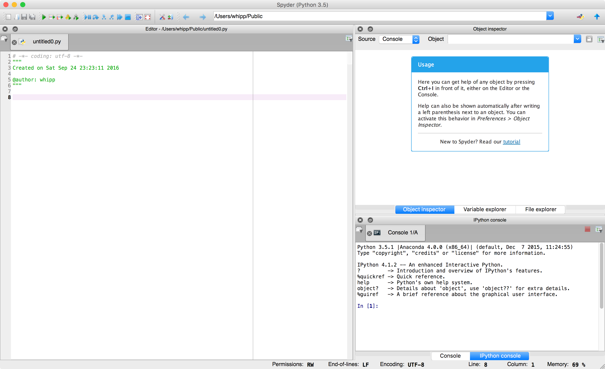
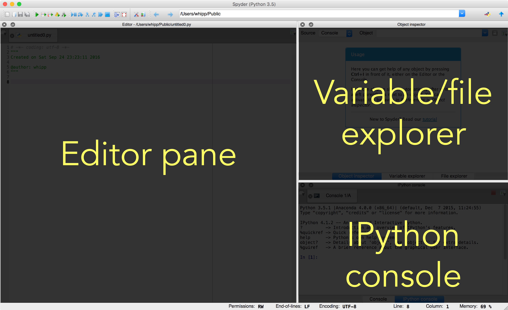

# Using the Spyder Integrated Development Environment (IDE)

## Sections

1. [What is an IDE?](#what-is-an-integrated-development-environment)
2. [An overview of the Spyder IDE](#an-overview-of-the-spyder-ide)
  - [The editor pane](#the-editor-pane)
  - [The explorer pane](#the-explorer-pane)
  - [The console pane](#the-console-pane)
3. [Some Spyder tips and tricks](#some-spyder-tips-and-tricks)

## Before we start
If you haven't done so already, open **Spyder** by double clicking on the Spyder icon on the desktop of your computer instance or typing `spyder` in a terminal window and pressing **Enter**.
Also, for this demonstration we will be using the [Python script file `Spyder-demo-script.py`](../src/Spyder-demo-script.py) that is included in the git repository for this week's lesson.

## What is an integrated development environment?
An *integrated development environment* or *IDE* is a software program or package that provides a set of tools for writing, testing, and debugging software in a convenient, practical interface (often a single window).
Often, the components in the IDE include a text editor with options to help debug source code, a built-in terminal or console window, and a pane for viewing variable values, documentation or browsing files on the computer.
For us, the main reason for introducing an IDE is that it makes it easier and faster to write and test Python scripts, and common mistakes that can be made when writing code can be indicated in the IDE text editor to help you fix thinks more easily.
We will be using the [**Spyder** IDE](https://pythonhosted.org/spyder/) that is included with [Anaconda](https://www.continuum.io/anaconda-overview), but it is just one of [many Python IDEs](https://wiki.python.org/moin/IntegratedDevelopmentEnvironments).

## An overview of the Spyder IDE
 
*The Spyder IDE window*

For the rest of the lessons and exercises in this course we will be using the **Spyder** IDE.
As mentioned above, this will allow us to more easily create and edit Python scripts, as well as provide some helpful tools for continuing to learn programming in Python and resolve common code bugs.
As you can see above, the Spyder IDE window is broken into several different panes, labeled in the figure below.
We will briefly look at each in the following sections.

 
*Panes in the Spyder IDE window*

### The editor pane
The main pane on the left is the editor pane, used for writing Python scripts.
If you have already loaded the [`Spyder-demo-script.py`](../src/Spyder-demo-script.py) file, you will see it is basically a normal text editor window with colors used to highlight the text in the script.
In addition, you can see line numbers on the left side, which can be helpful when debugging.

There are several features that make the **Spyder** editor pane more useful than a standard text editor:

1. A popup window will appear when you type in functions, providing a bit of documentation about using them.
For example, when you type in the print statement, a window will pop up after you have typed `print(`, showing you how to use the function.
2. If you have a syntax error on a line of your program, a small yellow triangle or red octagon will be displayed to the left of that line.
Hovering over the triangle (or octagon) with your mouse will provide some additional information about the possible cause of the error.
3. Within **Spyder** you can easily run you Python scripts by either clicking on the green play icon in the set of icons at the top of the window, or by going to **Run** -> **Run** in the menu bar.

### The explorer pane

### The console pane

## Some Spyder tips and tricks
